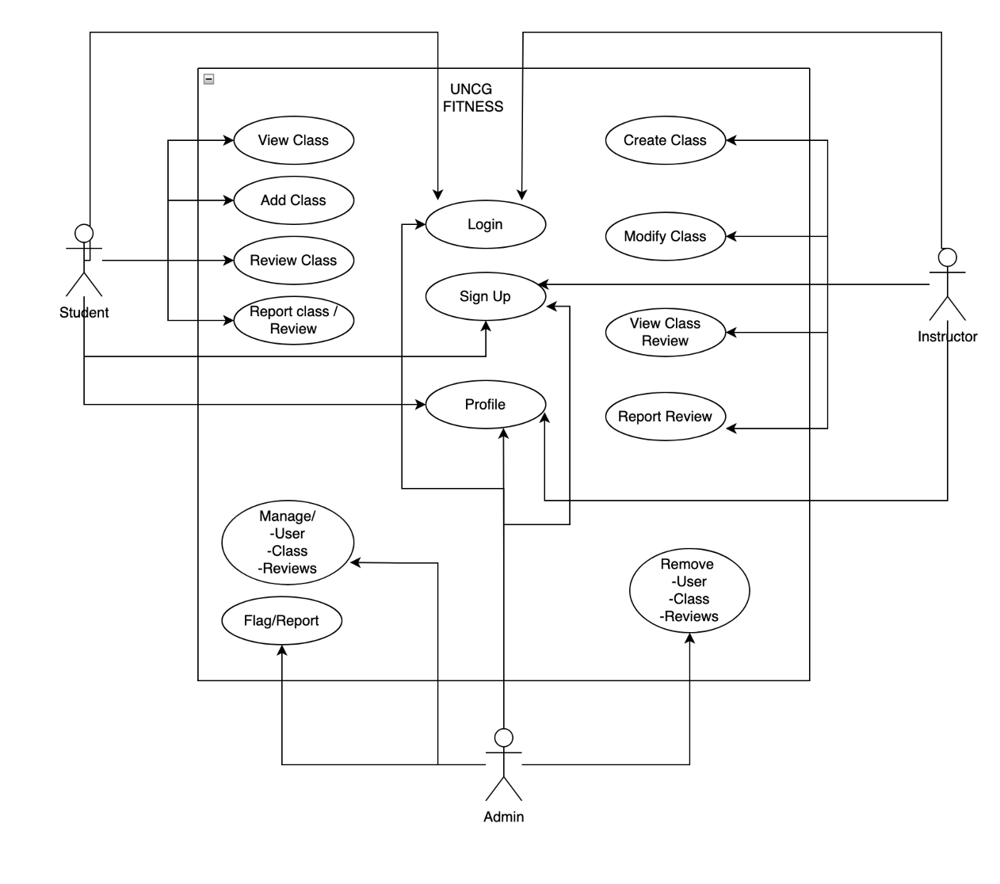

## Title

> The UNCG Group Fitness App

## Team Members

> Trinity Boler, Jennifer Galicia-Torres, and Natalie Hildreth
>
> Trinity Boler: Instructor/provider
>
> Jennifer Galicia-Torres: Student/user
>
> Natalie Hildreth: Admin

## Description
> The UNCG Group Fitness App is an application that allows UNCG students to sign up for different fitness classes provided by class instructors. 
Students are able to see the materials needed and/or provided for each class, as listed by the instructor under each class description. Instructors can create, delete, and modify classes. They can then schedule classes at specific times for students to pick. Administrators can oversee messages and classes, allowing them to flag and delete content. 
The motivation for this app is to encourage UNCG students to improve their health and well-being. Our main goal is to give individuals the opportunity to select the fitness class that they feel most comfortable with. Scheduling a fitness course will be based on their availability, comfort level, fitness instructor, and level of fitness. 
The UNCG Group Fitness App will help to solve the issue of availability issues. Therefore, individuals will now have the opportunity to schedule a fitness course based on their availability, intensity of the fitness course, and comfortability with the instructor.

---

---
> Clone the repo and make sure you have a database named UNCG-Fitness-Connect and upload the UNCG-Connect-SQL file to the database.
> 
> All passwords are password
> 
> STUDENT: Username = StudentTest
> 
> INSTRUCTOR Username = InstructorTest
> 
> ADMIN  Username = AdminTest

- Clone the project and open in an IDE.
- Open XAMPP Control Panel Dashboard.
- Start Apache.
- Start MySQL.
- Click on MySQL Admin, to open the database dashboard on your browser.
- Create a database with the name 'UNCG-Connect-SQL'.
- Import 'UNCG-Fitness-Connect.sql'.
- Clean and Build the project.

Run->Set Project Configuration->Customize->Run->Main Class->Browse->Select com.UNCG_Fitness.UNCG_Fitness_Connect.UncgFitnessConnectApplication.

- Run the main method.
- On web browser: http://localhost:8080
Login with three user types with username below:

> STUDENT: Username = StudentTest
> 
> INSTRUCTOR Username = InstructorTest
> 
> ADMIN  Username = AdminTest
> 
> All passwords are password
> 

when creating a class url must be a image adress.

---

